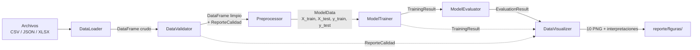

# Documentación técnica — Framework ML para Análisis Crediticio

Documento de referencia técnica del código en `src/`. Describe el flujo de datos, cada módulo,
clase y método público, los modelos utilizados y la comparación de resultados.

> Todos los valores numéricos corresponden a la ejecución de `python main.py` con los 135
> clientes de `Docs/` (semilla 42).

---

## 1. Arquitectura general

El framework es un pipeline de seis componentes, cada uno en su propio paquete dentro de
`src/`. Cada componente recibe la salida del anterior y no depende de su implementación
interna (Principio I de `.specify/memory/constitution.md`).

| Paquete | Responsabilidad | Entrada | Salida |
|---|---|---|---|
| `data_loader` | Leer archivos de distintos formatos | Ruta de archivo | `pd.DataFrame` crudo |
| `data_validator` | Validar estructura, limpiar y medir calidad | `DataFrame` crudo | `DataFrame` limpio, `ReporteCalidad` |
| `preprocessor` | Combinar fuentes, definir la variable objetivo y preparar los datos para el modelo | 3 `DataFrame` limpios | `ModelData` |
| `model_trainer` | Entrenar los modelos supervisados y la segmentación | `ModelData` | `TrainingResult` |
| `model_evaluator` | Calcular métricas, comparar modelos y evaluar la segmentación | `TrainingResult` | `EvaluationResult` |
| `data_visualizer` | Generar gráficas con interpretación | Resultados de los anteriores | `GraficaInterpretada` (PNG) |
| `exceptions.py` | Jerarquía de errores del framework | — | — |

Scripts en la raíz:

| Archivo | Uso |
|---|---|
| `main.py` | Flujo completo, paso a paso y comentado (punto de entrada recomendado) |
| `ejemplo_preprocesador.py` | Ejemplo centrado en carga, limpieza y preprocesamiento |
| `ejemplo_modelos.py` | Ejemplo centrado en entrenamiento, evaluación y gráficas |
| `scripts/generar_clientes_sinteticos.py` | Genera los 100 clientes sintéticos (CLI-1036 a CLI-1135) con semilla fija |

---

## 2. Flujo de datos, desde la carga hasta las gráficas

| Paso | Llamada | Qué ocurre técnicamente | Tipo de salida | Valores con `Docs/` |
|---|---|---|---|---|
| 1. Carga | `DataLoader().load(ruta)` | Detecta el formato por la extensión y delega en el lector correspondiente (`CsvReader`, `JsonReader`, `XlsxReader`) | `pd.DataFrame` | Perfil 138×5, historial 171×5, buró 129×4 |
| 2. Revisión de calidad (antes) | `DataValidator().revisar_calidad(df, fuente)` → `.resumen()` para leerlo | Cuenta filas, faltantes por columna, duplicados exactos, `ID_Cliente` repetidos y edades fuera de [18, 70], sin modificar los datos | `ReporteCalidad` | Perfil: 12 faltantes, 3 duplicados, 9 edades atípicas |
| 3. Limpieza | `limpiar_perfil_solicitante`, `limpiar_historial_transaccional`, `limpiar_buro_credito` | Valida columnas esperadas, normaliza formatos (morosidad a 0/1, USD→MXN, prefijo `CLIENTE_`→`CLI-`, vivienda a 0/1), marca faltantes y edades atípicas como `NaN` ("ND") y elimina duplicados | `pd.DataFrame` | Perfil 135 filas, 21 "ND"; historial 171 filas, 10 "ND" |
| 4. Combinación | `Preprocessor().merge_sources(perfil, historial, buro)` | `merge` *outer* por `ID_Cliente` (unión de clientes, sin rellenar huecos); agrega `credito_aprobado = 0` | `pd.DataFrame` | 178 filas (1 por transacción), 135 clientes |
| 5. Variable objetivo | `define_credit_approval(combinada)` | Aplica la regla de negocio por cliente: `18 ≤ Edad ≤ 69` **y** `Score_Buro > 600` **y** `Mantiene_Morosidad_Previa == 0` **y** alguna fila con `Frecuencia_Deposito > 0`. Un `NaN` nunca cumple | `pd.DataFrame` | 47 aprobados, 88 no aprobados |
| 6a. Una fila por cliente | `aggregate_by_client(etiquetada)` (lo llama `prepare_for_model`) | `groupby("ID_Cliente")`: suma de montos, promedio de saldo, máximo de frecuencia, número de transacciones; `first` para el resto; descarta `Moneda` | `pd.DataFrame` | 135 filas |
| 6b. Separación | `TrainTestSplitter.split(X, y)` | `train_test_split` estratificado por `y` (80/20, semilla 42) | 4 objetos `pandas` | 108 / 27 clientes (38 / 9 aprobados) |
| 6c. Imputación | `DataImputer.fit(X_train).transform(...)` | `SimpleImputer`: mediana (numéricas) o moda (texto), aprendida **solo** de `X_train` | `pd.DataFrame` | 0 faltantes |
| 6d. Codificación | `CategoricalEncoder.fit(X_train).transform(...)` | `OneHotEncoder` sobre columnas de texto (`handle_unknown="ignore"`) | `pd.DataFrame` | Sin cambios: no quedan columnas de texto |
| 6e. Escalado | `FeatureScaler.fit(X_train).transform(...)` | `StandardScaler` sobre numéricas no binarias, con media y desviación de `X_train` | `pd.DataFrame` | 9 escaladas; 2 binarias sin escalar |
| 6. Resultado | `prepare_for_model(etiquetada)` | Ejecuta 6a–6e en orden y empaqueta todo | `ModelData` | `X_train` 108×11, `X_test` 27×11 |
| 7. Entrenamiento | `ModelTrainer().train(datos)` | Ajusta `LogisticRegression` y `RandomForestClassifier` con `X_train`/`y_train`, y `KMeans` con `X_train` (sin `y`); asigna segmento a los 135 clientes | `TrainingResult` | 3 modelos en ~0.25 s |
| 8. Evaluación | `ModelEvaluator().evaluate(resultado)` | Métricas en prueba, validación cruzada estratificada (5 particiones), tabla comparativa, recomendación, importancia de variables, silhouette (k=2..5) y perfiles de segmento | `EvaluationResult` | Recomendado: random forest |
| 9. Gráficas | `ReportFigures.generar(...)` + `guardar_todas(..., carpeta)` | 10 figuras con Seaborn/Matplotlib, cada una con una interpretación generada de los mismos datos | `list[GraficaInterpretada]` | 10 PNG en `reporte/figuras/` |

**Regla anti-fuga de información**: en el paso 6, la separación ocurre **antes** de imputar,
codificar y escalar. Los parámetros (medianas, categorías, medias y desviaciones) se
aprenden con `fit(X_train)` y se aplican con `transform` a ambos conjuntos, así que ningún
dato del conjunto de prueba influye en el entrenamiento.

---

## 3. Módulos, clases y métodos

### 3.1 `data_loader` — carga de archivos

| Módulo | Clase | Método / atributo | Descripción técnica | Entrada → Salida |
|---|---|---|---|---|
| `loader.py` | `DataLoader` | `_READERS_POR_FORMATO` | Diccionario extensión → clase lectora (`csv`, `json`, `xlsx`). Patrón *Strategy*: agregar un formato solo requiere un lector nuevo y una entrada aquí | — |
| `loader.py` | `DataLoader` | `load(path)` | Valida que `path` no esté vacío y exista; obtiene la extensión en minúsculas; instancia el lector del formato y llama a `read`. Lanza `MissingFilePathError`, `FileNotFoundInSourceError` o `UnsupportedFileFormatError` | `str` → `pd.DataFrame` |
| `readers.py` | `BaseFileReader` (abstracta, `ABC`) | `read(path)` | Método abstracto que define la interfaz común de los lectores (polimorfismo) | `str` → `pd.DataFrame` |
| `readers.py` | `CsvReader` | `read(path)` | `pd.read_csv`; convierte errores de parseo en `DataParsingError` | `str` → `pd.DataFrame` |
| `readers.py` | `JsonReader` | `read(path)` | `pd.read_json(orient="records")` (lista de objetos); errores → `DataParsingError` | `str` → `pd.DataFrame` |
| `readers.py` | `XlsxReader` | `read(path)` | `pd.read_excel` (motor `openpyxl`); errores → `DataParsingError` | `str` → `pd.DataFrame` |

### 3.2 `data_validator` — validación, limpieza y calidad

| Módulo | Clase | Método / atributo | Descripción técnica | Entrada → Salida |
|---|---|---|---|---|
| `validator.py` | `DataValidator` | `__init__(tasa_cambio_usd_mxn=15)` | Guarda la tasa de conversión configurable | — |
| `validator.py` | `DataValidator` | `COLUMNAS_ESPERADAS` | `dict` fuente → lista de columnas obligatorias | — |
| `validator.py` | `DataValidator` | `EDAD_MINIMA = 18`, `EDAD_MAXIMA = 70` | Rango válido de edad (inclusivo) | — |
| `validator.py` | `DataValidator` | `limpiar_buro_credito(df)` | Valida columnas; normaliza `Mantiene_Morosidad_Previa` a 0/1 (acepta "SI", "no", "1", "true", `True`, `0`…; nulo → 0); reemplaza el prefijo `CLIENTE_` por `CLI-` (sin importar mayúsculas); elimina filas idénticas y `ID_Cliente` repetidos (conserva el primero) | `DataFrame` → `DataFrame` |
| `validator.py` | `DataValidator` | `limpiar_historial_transaccional(df)` | Valida columnas; convierte `Monto_Transaccion` y `Saldo_Promedio_Mensual` a numérico (`errors="coerce"`); `Moneda` nula → "MXN"; multiplica montos en USD por la tasa y cambia su moneda a "MXN"; elimina filas idénticas (varias transacciones por cliente son válidas). Los faltantes quedan como `NaN` | `DataFrame` → `DataFrame` |
| `validator.py` | `DataValidator` | `limpiar_perfil_solicitante(df)` | Valida columnas; `Edad` fuera de [18, 70], nula o no numérica → `NaN`; `Ingreso_Declarado` y `Antiguedad_Laboral` a numérico (faltantes como `NaN`); `Tipo_Vivienda` → 1 si es "propia", 0 en otro caso; elimina duplicados e IDs repetidos | `DataFrame` → `DataFrame` |
| `validator.py` | `DataValidator` | `revisar_calidad(df, fuente)` | Diagnóstico sin modificar los datos: filas, columnas faltantes y adicionales, tipos, faltantes por columna, duplicados, `ID_Cliente` repetidos (perfil y buró) y edades atípicas (perfil). Nunca falla por datos sucios; solo lanza `UnknownSourceError` si la fuente no existe | `DataFrame`, `str` → `ReporteCalidad` |
| `reporte.py` | `ReporteCalidad` (`dataclass` inmutable) | `estructura_valida` (propiedad) | `True` si no faltan columnas esperadas | → `bool` |
| `reporte.py` | `ReporteCalidad` | `como_tabla()` | Detalle por columna: nombre, tipo y número de faltantes | → `DataFrame` |
| `reporte.py` | `ReporteCalidad` | `resumen()` | Texto legible de varias líneas: filas, estructura, duplicados, IDs repetidos, edades atípicas (solo si aplican) y columnas con faltantes | → `str` |
| `validator.py` | `DataValidator` | `comparar_calidad(antes, despues)` (estático) | Tabla con índice `indicador` y columnas `antes`/`después`: filas, duplicados, IDs repetidos, edades atípicas, columnas faltantes y una fila por cada columna con faltantes. Lanza `DataValidatorError` si los reportes son de fuentes distintas | `ReporteCalidad` ×2 → `DataFrame` |

### 3.3 `preprocessor` — combinación, variable objetivo y preparación para el modelo

| Módulo | Clase | Método / atributo | Descripción técnica | Entrada → Salida |
|---|---|---|---|---|
| `preprocessor.py` | `Preprocessor` | `EDAD_MINIMA_APROBACION = 18`, `EDAD_MAXIMA_APROBACION = 69`, `SCORE_MINIMO_APROBACION = 600` | Umbrales de la regla de aprobación (score exclusivo: `> 600`) | — |
| `preprocessor.py` | `Preprocessor` | `merge_sources(perfil, historial, buro)` | Dos `merge(how="outer")` por `ID_Cliente`. No rellena los huecos: lo que falta de una fuente queda `NaN`. Agrega `credito_aprobado = 0` como valor inicial | 3 `DataFrame` → `DataFrame` |
| `preprocessor.py` | `Preprocessor` | `show_combined_table(df, title)` | Muestra la tabla delegando en `DataVisualizer.mostrar_tabla` | `DataFrame` → `Figure` |
| `preprocessor.py` | `Preprocessor` | `define_credit_approval(df)` | Calcula las 4 condiciones de forma vectorizada; la de depósitos se agrega por cliente con `groupby().transform("any")`, y el resultado final con `transform("all")`, para que todas las filas de un cliente tengan el mismo valor | `DataFrame` → `DataFrame` |
| `preprocessor.py` | `Preprocessor` | `approval_summary(df)` | Cuenta **clientes** (no filas) por clase; siempre devuelve el índice `[0, 1]` | `DataFrame` → `pd.Series` |
| `preprocessor.py` | `Preprocessor` | `aggregate_by_client(df)` | Una fila por cliente: `Monto_Total` (suma con `min_count=1`), `Saldo_Promedio_Mensual` (media), `Frecuencia_Deposito_Max` (máximo), `Num_Transacciones` (conteo); `first` para las demás columnas; descarta `Moneda` | `DataFrame` → `DataFrame` |
| `preprocessor.py` | `Preprocessor` | `prepare_for_model(df, test_size=0.2, random_state=42)` | Orquesta: agregación → separación de `X`/`y` → `TrainTestSplitter` → descarte de columnas constantes → `DataImputer` → `CategoricalEncoder` → `FeatureScaler`, con `fit` siempre sobre `X_train` | `DataFrame` → `ModelData` |
| `splitter.py` | `TrainTestSplitter` | `split(X, y)` | Verifica que cada clase tenga al menos 2 elementos; `train_test_split(..., stratify=y)`; reinicia índices | `DataFrame`, `Series` → 4-tupla |
| `imputer.py` | `DataImputer` | `fit(X)` | Descarta columnas sin ningún valor; ajusta `SimpleImputer(strategy="median")` para numéricas y `"most_frequent"` para texto; guarda `valores_imputacion` | `DataFrame` → `self` |
| `imputer.py` | `DataImputer` | `transform(X)` / `fit_transform(X)` | Rellena faltantes con los valores aprendidos; normaliza `None`→`NaN` antes de imputar | `DataFrame` → `DataFrame` |
| `encoder.py` | `CategoricalEncoder` | `fit(X)` | Detecta columnas no numéricas y ajusta `OneHotEncoder(handle_unknown="ignore")`; guarda `categorias` | `DataFrame` → `self` |
| `encoder.py` | `CategoricalEncoder` | `transform(X)` / `fit_transform(X)` | Reemplaza cada columna de texto por columnas `<col>_<categoría>` 0/1; categorías nuevas → todo 0 | `DataFrame` → `DataFrame` |
| `scaler.py` | `FeatureScaler` | `fit(X)` | Selecciona columnas numéricas no binarias y ajusta `StandardScaler`; guarda `parametros` (media, desviación) | `DataFrame` → `self` |
| `scaler.py` | `FeatureScaler` | `transform(X)` / `fit_transform(X)` | Aplica `(x − media) / desviación` con los parámetros de entrenamiento | `DataFrame` → `DataFrame` |
| `model_data.py` | `ModelData` (`dataclass` inmutable) | campos | `X_train`, `X_test`, `y_train`, `y_test`, `ids_train`, `ids_test`, `variables`, `descartadas`, `valores_imputacion`, `parametros_escalado` | — |
| `model_data.py` | `ModelData` | `as_tuple()` | Devuelve `(X_train, X_test, y_train, y_test)` | → 4-tupla |

### 3.4 `model_trainer` — entrenamiento

| Módulo | Clase | Método / atributo | Descripción técnica | Entrada → Salida |
|---|---|---|---|---|
| `base.py` | — | `validar_X(X)` | Función de módulo: falla si `X` está vacío, tiene columnas no numéricas o faltantes | `DataFrame` → `None` |
| `base.py` | — | `validar_columnas(X, variables)` | Falla si las columnas no son las de entrenamiento, en el mismo orden | → `None` |
| `base.py` | `SupervisedModel` (clase base) | `fit(X, y)` | Valida `X`, largos iguales y al menos 2 clases; crea el estimador con `_crear_estimador()`; mide el tiempo con `perf_counter`; guarda `variables` | `DataFrame`, `Series` → `self` |
| `base.py` | `SupervisedModel` | `predict(X)` | Valida entrenamiento y columnas; predicción 0/1 | `DataFrame` → `Series[int]` |
| `base.py` | `SupervisedModel` | `predict_proba(X)` | Probabilidad de la clase 1 (aprobado) | `DataFrame` → `Series[float]` |
| `base.py` | `SupervisedModel` | `entrenado`, `hiperparametros` (propiedades) | Estado del modelo y parámetros con los que se creó | — |
| `logistic_model.py` | `LogisticRegressionModel(SupervisedModel)` | `hiperparametros`, `_crear_estimador()` | `LogisticRegression(C=1.0, max_iter=1000, random_state=42)` | — |
| `random_forest_model.py` | `RandomForestModel(SupervisedModel)` | `hiperparametros`, `_crear_estimador()` | `RandomForestClassifier(n_estimators=100, random_state=42)` | — |
| `segmentation.py` | `ClientSegmentation` | `fit(X)` | Valida `X` y `n_segmentos ≤ len(X)`; ajusta `KMeans(n_clusters=3, n_init=10, random_state=42)`; guarda `centros`. **No recibe `y`** | `DataFrame` → `self` |
| `segmentation.py` | `ClientSegmentation` | `predict(X)` | Asigna el segmento más cercano (0..k−1) | `DataFrame` → `Series[int]` |
| `trainer.py` | `ModelTrainer` | `train(datos)` | Entrena los 2 supervisados y la segmentación; concatena los segmentos de entrenamiento y prueba con índice `ID_Cliente` | `ModelData` → `TrainingResult` |
| `training_result.py` | `TrainingResult` (`dataclass` inmutable) | campos | `modelos` (dict por nombre), `segmentacion`, `segmentos`, `variables`, `datos` | — |
| `training_result.py` | `TrainingResult` | `resumen()` | Tabla de modelos: tipo, hiperparámetros y tiempo de entrenamiento | → `DataFrame` |

`LogisticRegressionModel` y `RandomForestModel` heredan validaciones, medición de tiempo y
formato de salida de `SupervisedModel`. Cada subclase solo define cómo crear su estimador
(herencia y polimorfismo).

### 3.5 `model_evaluator` — evaluación y comparación

| Módulo | Clase | Método / atributo | Descripción técnica | Entrada → Salida |
|---|---|---|---|---|
| `metrics.py` | — | `DESCRIPCION_METRICAS` | Texto en español por métrica: qué mide y por qué importa en crédito | — |
| `metrics.py` | `ClassificationMetrics` | `calcular(y_real, y_pred, y_prob)` | `accuracy`, `precision`, `recall`, `f1` (clase positiva = 1, `zero_division=0`), `roc_auc` (si hay 2 clases) y matriz de confusión (`VN, FP, FN, VP`); agrega notas para los casos especiales | `Series` → `MetricasModelo` |
| `metrics.py` | `MetricasModelo` (`dataclass`) | `como_dict()` | Las 9 métricas como diccionario | → `dict` |
| `cross_validation.py` | `CrossValidator` | `evaluar(modelo, X, y)` | `StratifiedKFold(5, shuffle=True, random_state=42)` + `cross_validate` sobre `clone(modelo.estimador)` (no toca el modelo original); media y desviación de 4 métricas | → `DataFrame` 4×2 |
| `comparison.py` | `ModelComparator` | `comparar(metricas, cv)` | Tabla modelos × métricas (prueba y validación cruzada) | → `DataFrame` |
| `comparison.py` | `ModelComparator` | `recomendar(tabla)` | Ordena por `precision_cv` → `f1_cv` → simplicidad (regresión logística). Marca `diferencia_significativa = False` si la diferencia es menor que la desviación, y advierte si `recall_cv < 0.5` | → `Recomendacion` |
| `comparison.py` | `Recomendacion` (`dataclass`) | campos | `modelo`, `criterio`, `diferencia_significativa`, `justificacion` | — |
| `importance.py` | `FeatureImportance` | `calcular(modelo)` | `coef_[0]` (regresión logística, con signo) o `feature_importances_` (random forest); ordena por magnitud y marca las variables de la regla | → `DataFrame` |
| `segmentation_evaluator.py` | `SegmentationEvaluator` | `silhouette(X, segmentacion)` | Silhouette de K-means para k = 2..5 | → `DataFrame` |
| `segmentation_evaluator.py` | `SegmentationEvaluator` | `silhouette_modelo(X, seg)`, `k_sugerido(tabla)` | Silhouette del modelo entrenado y el k con mayor silhouette | → `float`, `int` |
| `segmentation_evaluator.py` | `SegmentationEvaluator` | `perfiles(resultado)` | Deshace el escalado (`x·σ + μ`) y agrupa por segmento: número de clientes, promedio de cada variable en escala original y tasa de aprobación | → `DataFrame` |
| `evaluator.py` | `ModelEvaluator` | `evaluate(resultado)` | Orquesta todo lo anterior | `TrainingResult` → `EvaluationResult` |
| `evaluation_result.py` | `EvaluationResult` (`dataclass`) | campos | `metricas`, `validacion_cruzada`, `comparacion`, `recomendacion`, `importancias`, `silhouette`, `silhouette_modelo`, `k_sugerido`, `perfiles_segmentos`, `descripcion_metricas` | — |

### 3.6 `data_visualizer` — gráficas

| Módulo | Clase | Método / atributo | Descripción técnica | Entrada → Salida |
|---|---|---|---|---|
| `visualizer.py` | `DataVisualizer` | `mostrar_tabla(df, titulo)` | Tabla de matplotlib; los `NaN` se muestran como "ND" | `DataFrame` → `Figure` |
| `visualizer.py` | `DataVisualizer` | `graficar_creditos_vs_score`, `graficar_score_vs_ingreso`, `graficar_distribucion_tipo_vivienda` | Gráficas exploratorias básicas (feature 003) | `DataFrame` → `Figure` |
| `estilo.py` | — | `nueva_figura(filas, columnas, tamano, proporciones)` | Crea la figura con `matplotlib.figure.Figure` (sin `pyplot`) y aplica el estilo común | → `(Figure, Axes)` |
| `estilo.py` | — | Constantes de color | Paleta validada para daltonismo; `COLOR_MODELO` fija un color por modelo | — |
| `grafica.py` | `GraficaInterpretada` (`dataclass`) | `guardar(carpeta)` | Guarda el PNG (150 dpi) y devuelve una copia con `ruta` | → `GraficaInterpretada` |
| `quality_charts.py` | `QualityCharts` | `calidad(antes, despues)` | Barras agrupadas antes/después: faltantes por columna, duplicados y edades atípicas | `ReporteCalidad` ×2 → `GraficaInterpretada` |
| `exploratory_charts.py` | `ExploratoryCharts` | `distribucion_clases(tabla)` | Barras con conteo y % por clase | → `GraficaInterpretada` |
| `exploratory_charts.py` | `ExploratoryCharts` | `correlaciones(tabla)` | Mapa de calor de Pearson (escala divergente), sin `ID_Cliente` ni columnas constantes | → `GraficaInterpretada` |
| `model_charts.py` | `ModelCharts` | `matriz_confusion(evaluacion)` | Un mapa de calor 2×2 por modelo, con conteo y % | → `GraficaInterpretada` |
| `model_charts.py` | `ModelCharts` | `curva_roc(resultado)` | Curvas ROC (`roc_curve`) de ambos modelos y la diagonal del azar | → `GraficaInterpretada` |
| `model_charts.py` | `ModelCharts` | `importancia(evaluacion)` | Barras horizontales por modelo; variables de la regla resaltadas | → `GraficaInterpretada` |
| `segmentation_charts.py` | `SegmentationCharts` | `silhouette(evaluacion)` | Barras por k; resalta el usado y marca el sugerido | → `GraficaInterpretada` |
| `segmentation_charts.py` | `SegmentationCharts` | `pca_segmentos(resultado)` | `PCA(2)` sobre los 135 clientes, coloreado por segmento, con etiquetas directas | → `GraficaInterpretada` |
| `report_figures.py` | `ReportFigures` | `generar(...)`, `guardar_todas(graficas, carpeta)` | Genera las 11 gráficas en orden y las guarda | → `list[GraficaInterpretada]` |

### 3.7 `exceptions.py` — errores del framework

Todas heredan de `FrameworkError`, que registra automáticamente el error en consola con el
prefijo `[FRAMEWORK ERROR]`.

| Componente | Base | Excepciones específicas |
|---|---|---|
| DataLoader | `DataLoaderError` | `MissingFilePathError`, `FileNotFoundInSourceError`, `UnsupportedFileFormatError`, `DataParsingError` |
| DataValidator | `DataValidatorError` | `MissingColumnsError`, `UnknownSourceError` |
| Preprocessor | `PreprocessorError` | `MissingRuleColumnsError`, `ModelPreparationError` |
| ModelTrainer | `ModelTrainerError` | `InvalidTrainingDataError`, `ModelNotTrainedError` |
| ModelEvaluator | `ModelEvaluatorError` | `EvaluationError` |

---

## 4. Modelos utilizados

### 4.1 Supervisados (predicen `credito_aprobado`)

| | Regresión logística | Random forest |
|---|---|---|
| **Tipo** | Lineal, clasificación binaria | Ensamble de árboles de decisión (*bagging*) |
| **Cómo decide** | Combinación lineal de las variables pasada por la función logística: `P(aprobado) = 1 / (1 + e^-(β₀ + Σβᵢxᵢ))` | Cada árbol divide los datos con umbrales (p. ej. `Score_Buro ≤ 600.5`); la predicción es el voto promedio de los 100 árboles |
| **Hiperparámetros** | `C=1.0` (regularización L2), `max_iter=1000`, `random_state=42` | `n_estimators=100`, `random_state=42` (resto por defecto) |
| **Interpretación** | Coeficientes con signo, comparables entre sí porque las variables están estandarizadas | Importancia de cada variable (reducción media de impureza; suman 1) |
| **Por qué se eligió** | Estándar de la industria en *scoring* crediticio; interpretable; sirve de línea base | Captura relaciones no lineales y combinaciones de umbrales, como la regla real ("edad entre 18 y 69 **y** score > 600 **y** …") |
| **Limitación** | Solo modela relaciones lineales; no representa bien un rango (18–69) ni la condición "todas a la vez" | Menos interpretable; tiende a memorizar el entrenamiento (exactitud 1.00 en `X_train`) |

### 4.2 No supervisado (segmentación)

| | K-means |
|---|---|
| **Tipo** | *Clustering* por particiones |
| **Cómo decide** | Busca 3 centros que minimicen la distancia cuadrática de cada cliente a su centro (inercia); repite la inicialización 10 veces (`n_init=10`) |
| **Datos** | Las 11 variables preparadas (imputadas y escaladas); **no** usa `credito_aprobado` |
| **Evaluación** | Silhouette para k = 2..5 y perfiles de cada segmento en escala original |
| **Por qué se eligió** | El algoritmo de segmentación más conocido; funciona bien con datos escalados; asigna segmento a clientes nuevos (`predict`); cada segmento tiene un "cliente típico" (su centro) fácil de explicar |

**PCA** se usa solo para **visualizar** los segmentos en 2 dimensiones (gráfica
`pca_segmentos`); no forma parte del modelo.

---

## 5. Resultados y modelo recomendado

### 5.1 Comparación (135 clientes; prueba = 27 clientes; validación cruzada = 5 particiones sobre 108)

| Métrica | Regresión logística | Random forest |
|---|---|---|
| Exactitud (prueba) | 0.704 | **0.926** |
| Precisión (prueba) | 0.571 | **0.818** |
| Recall (prueba) | 0.444 | **1.000** |
| F1 (prueba) | 0.500 | **0.900** |
| AUC-ROC (prueba) | 0.833 | **0.910** |
| Matriz (prueba): VP / FP / VN / FN | 4 / 3 / 15 / 5 | 9 / 2 / 16 / 0 |
| **Exactitud (CV)** | 0.694 ± 0.085 | **0.870 ± 0.036** |
| **Precisión (CV)** — criterio principal | 0.587 ± 0.186 | **0.837 ± 0.091** |
| **Recall (CV)** | 0.439 ± 0.161 | **0.807 ± 0.168** |
| **F1 (CV)** | 0.493 ± 0.167 | **0.806 ± 0.075** |

### 5.2 Modelo recomendado: **Random forest**

- **Criterio** (decidido en la feature 010): mayor **precisión** media en validación
  cruzada, porque el error más costoso es aprobar a quien no cumple la política (falso
  positivo). Desempate por F1 y, si persiste, por simplicidad.
- **Resultado**: precisión 0.837 contra 0.587. La diferencia (0.25) es mayor que la
  desviación entre particiones (máximo 0.186), así que **es significativa**.
- **Además gana en todas las demás métricas** y es más estable (desviación de la exactitud
  0.036 contra 0.085).
- **Aprendió la regla**: sus 3 variables más importantes son `Score_Buro` (0.282),
  `Mantiene_Morosidad_Previa` (0.160) y `Frecuencia_Deposito_Max` (0.111), las tres parte de
  la regla de aprobación.
- **Por qué la regresión logística queda atrás**: la regla es una combinación de umbrales
  ("todas las condiciones a la vez" y un rango de edad). Un modelo lineal no la representa
  bien, por eso su recall es bajo (0.44): rechaza a más de la mitad de los clientes que sí
  cumplen. Aun así, identifica bien la dirección de las dos variables principales:
  morosidad −2.64 y score +1.02.

### 5.3 Segmentación

| Segmento | Clientes | Edad media | Score medio | % con morosidad | Tasa de aprobación |
|---|---|---|---|---|---|
| 0 | 47 | 31.9 | 651 | 21% | 32% |
| 1 | 63 | 53.5 | 638 | 25% | 38% |
| 2 | 25 | 38.4 | 642 | 40% | 32% |

Silhouette 0.15 (estructura **débil**; k = 3 es el mejor entre 2 y 5). Los segmentos sirven
para describir perfiles (por ejemplo, el segmento 2 concentra la mayor morosidad), pero no
son grupos naturalmente separados.

### 5.4 Limitaciones técnicas a considerar

1. **Datos sintéticos**: 35 clientes escritos a mano y 100 generados con una semilla fija; no
   son datos reales de una institución.
2. **Variables de la regla dentro del modelo**: las 4 variables con las que se define
   `credito_aprobado` también son variables de entrada (decisión Q1: B, feature 008). Las
   métricas miden qué tan bien el modelo **recupera** la regla de negocio, no su capacidad de
   predecir el comportamiento de pago real.
3. **Tamaño de la muestra**: con 35 clientes los modelos no aprendían la regla (≈50% de
   exactitud en validación cruzada); con 135 el random forest llega a 87%. Más datos
   probablemente mejorarían aún más los resultados y su estabilidad.
4. **Validación cruzada sobre datos ya preprocesados**: la imputación y el escalado se
   ajustaron con todo `X_train` antes de la validación cruzada, lo que introduce una fuga
   mínima entre particiones. Lo correcto sería rehacer el preprocesamiento dentro de cada
   partición (mejora futura).
5. **Sin búsqueda de hiperparámetros**: se usaron valores estándar.

---

## 6. Decisiones técnicas y dónde están documentadas

| Decisión | Valor elegido | Documento |
|---|---|---|
| Faltantes | `NaN` mostrado como "ND", en lugar de 0 | `specs/006-datavalidator-calidad-datos/spec.md` (Clarifications) |
| Edad atípica | < 18 o > 70 → "ND", sin eliminar el cliente | `specs/006-…/spec.md` |
| Regla de aprobación | 18–69 años, score > 600, sin morosidad, `Frecuencia_Deposito > 0` | `specs/007-preprocessor-credito-aprobado/spec.md` |
| Combinación de fuentes | Unión sin relleno | `specs/005-preprocesador-fusion-clientes/spec.md` (Amendment 2) |
| Variables del modelo | Todas, incluidas las de la regla | `specs/008-preprocesamiento-modelo/spec.md` (Clarifications) |
| Criterio de recomendación | Precisión → F1 → simplicidad | `specs/010-model-evaluator/spec.md` (Clarifications) |
| Corrección de morosidad en texto ("1", "true") | Se normalizan a 1 | `specs/002-datavalidator-limpieza/spec.md` (Amendment 4) |
| Datos sintéticos | 100 clientes con semilla 2026 | `scripts/generar_clientes_sinteticos.py`; `specs/010-…/research.md` (R9) |
